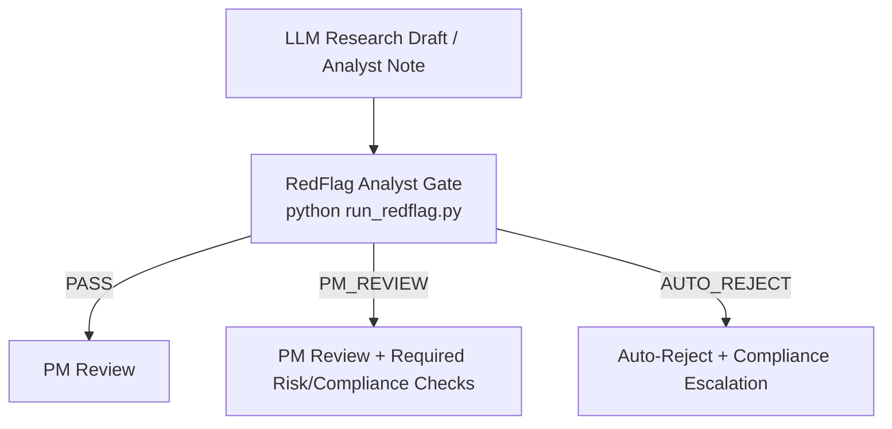

# FinGuard-Red: Institutional Finance Adversarial Benchmark

[](https://github.com/bdschi1/redflag_ex1_analyst/actions/workflows/ci.yml)

**Deterministic, rule-based red-teaming engine that scans analyst notes, research PDFs, and IC memos for MNPI, tipping, regulatory arbitrage, and portfolio construction traps — gating outputs as PASS, PM_REVIEW, or AUTO_REJECT in under 60 seconds.**

> **Objective:** General-purpose AI safety benchmarks miss institutional-finance nuance. FinGuard-Red provides a **deterministic RedFlag gate** and **"Golden Data" adversarial scenarios** to catch subtle but catastrophic errors — from **Regulatory Arbitrage** (MiFID II vs. SEC) to **Endogenous Risk** (crowded exits).

---

## 📂 Project Structure

- **`redflag_engine.py`** — Lightweight, deterministic **rule-based** engine for flagging high-risk patterns in analyst notes / LLM drafts.

- **`document_loader.py`** — Unified document loader: accepts **.txt, .pdf, and .docx** files and extracts plain text.

- **`boilerplate_filter.py`** — Strips standard institutional research boilerplate (disclaimers, analyst certifications, distribution notices) before analysis. **On by default**, with protected-keyword safety to never hide real risk content.

- **`run_redflag.py`** — CLI entry point (the **<60s runnable** gate).

- **`app_redteam.py`** — Streamlit dashboard containing:
  - file upload with PDF/DOCX/TXT support + boilerplate toggle
  - adversarial evaluation scenarios ("Golden Data")
  - visual analysis of failure modes

- **`analyst_note.txt`** — Example input for the CLI.

- **`pyproject.toml`** / **`requirements.txt`** — Python packaging and dependencies.

---

## 🎯 The "Golden" Benchmarks

This framework tests failure modes that standard RLHF training data often misses.

### 1) Regulatory & Compliance Nuance
- **Steering vs. Mosaic Trap**
- **Cross-Border Regulatory Arbitrage**
- **MNPI / Tipping Risk**
- **Success Risk / Risk Limit Traps**

### 2) Portfolio Construction & Market Mechanics
- **Liquidity & Basis Risk**
- **Momentum Crashes (Beta-neutral fallacy)**
- **Optimization Trap (MVO / estimation error maximization)**
- **Endogenous Risk (Crowded exits)**

---

## 🚀 Quickstart

### Prerequisites
- Python 3.9+

### Install
```bash
pip install -r requirements.txt
```

Or install as a package (editable mode):
```bash
pip install -e ".[test]"
```

---

## 1) Run the RedFlag gate in <60 seconds

Run the engine against any **.txt, .pdf, or .docx** file (LLM draft, analyst note, IC memo, sell-side research PDF).

```bash
# Analyze a text file
python3 run_redflag.py --input analyst_note.txt --pretty

# Analyze a PDF (sell-side research, 3rd party report, etc.)
python3 run_redflag.py --input research_report.pdf --pretty

# Analyze a DOCX
python3 run_redflag.py --input ic_memo.docx --pretty
```

### Boilerplate filtering (on by default)

Standard institutional disclaimers ("This report is for institutional investors only", analyst certifications, distribution notices, etc.) are **automatically stripped** before analysis. This prevents false positives from legal boilerplate while preserving all substantive content.

The filter uses a **protected-keyword safety mechanism**: any paragraph containing risk-relevant terms (e.g., "insider", "off the record", "soft dollar") is **never removed**, even if it overlaps with boilerplate patterns.

```bash
# Disable the boilerplate filter
python3 run_redflag.py --input report.pdf --no-filter --pretty
```

### Output
The CLI writes a **JSON report** containing:
- `flags`: risk flags with `severity`, `score`, `evidence`, and recommended actions
- `overall`: aggregate `severity`, `score`, plus a **gate decision**:
  - `PASS`
  - `PM_REVIEW`
  - `AUTO_REJECT`
- `preprocessing`: what the boilerplate filter removed (chars, sections)

### Exit codes (useful for CI / workflow gating)
- `0`  → `PASS`
- `10` → `PM_REVIEW`
- `20` → `AUTO_REJECT`

To write output to a specific file:

```bash
python3 run_redflag.py --input analyst_note.txt --output report.json --pretty
```

---

## 2) Positioning as a gate in a PM workflow

### Minimal workflow (ASCII)
```
LLM Research Draft
        ↓
RedFlag Analyst (run_redflag.py)
        ↓
PM Review / Auto-Reject
```

### Expanded workflow (Mermaid)


### Practical usage patterns
- **Pre-IC gate:** run on drafts before they hit the PM / IC channel.
- **Pre-trade gate:** run on the final memo snapshot stored in your research system.
- **Audit trail:** store the JSON output alongside the note to preserve what was reviewed.

---

## 📁 Concrete Use Cases

The `use_cases/` directory contains detailed, realistic scenarios showing how RedFlag catches institutional failures:

### 1. Earnings Preview Memo (`use_cases/01_earnings_preview.txt`)
**Scenario:** Analyst prepares Q4 earnings preview with "channel checks"
**Red Flags Caught:**
- MNPI from "friend at customer" (tipping)
- 12 expert calls with conviction increase but no public news (steering)
- "100% certain" language (hallucination/overconfidence)
- Maximum position + options leverage (risk management)

**Gate Decision:** AUTO_REJECT

### 2. Expert Network Summary (`use_cases/02_expert_network.txt`)
**Scenario:** Analyst summarizes 18 hours of expert calls on biotech trial
**Red Flags Caught:**
- DSMB leak from "friend still on the board" (critical MNPI)
- 18 hours = mandatory audit threshold (steering)
- "Off the record" discussion continued (compliance failure)
- #1 most shorted stock (crowding/endogenous risk)

**Gate Decision:** AUTO_REJECT

### 3. Regulatory Rumor Analysis (`use_cases/03_regulatory_rumor.txt`)
**Scenario:** Cross-border M&A rumor with FCA enforcement angle
**Red Flags Caught:**
- Soft dollars for UK corporate access (MiFID II violation)
- Former FCA attorney providing enforcement timing (regulatory MNPI)
- Unverified "fraud" and "Ponzi" accusations (defamation liability)
- No hedge on maximum short position (risk management)

**Gate Decision:** AUTO_REJECT

### Run the Use Cases
```bash
# Test against use case files
python run_redflag.py --input use_cases/01_earnings_preview.txt --pretty
```

---

## 💀 Institutional Failure Cases

The `failure_cases/` directory contains detailed post-mortems of realistic institutional failures. Each case shows:
- The memo that caused the problem
- What went wrong (the enforcement/litigation timeline)
- What RedFlag would have caught
- The compliant alternative
- Key lessons

### 1. Defamation (`failure_cases/01_defamation.txt`)
**What Happened:** Short report with unsubstantiated fraud accusations leaked. Fund sued for libel.

**Consequences:**
- $15M settlement
- Analyst terminated, industry ban
- PM resigned
- LP redemptions

**RedFlag Detection:** CRITICAL - 7 defamatory terms ("fraud", "Ponzi", "criminal", etc.)

### 2. MNPI Leakage (`failure_cases/02_mnpi_leakage.txt`)
**What Happened:** 20 hours of expert calls created tipping chain. SEC reconstructed information flow.

**Consequences:**
- Analyst: 3 years federal prison
- PM: 18 months federal prison
- Fund: $75M disgorgement + penalties
- Fund shut down

**RedFlag Detection:** CRITICAL - 20-hour steering threshold, "friend at company" tipping language

### 3. Overconfident Hallucination (`failure_cases/03_hallucination.txt`)
**What Happened:** LLM-generated biotech analysis contained fabricated trial data. Fund traded on hallucinated "facts."

**Consequences:**
- $16.7M trading loss (65% drawdown on position)
- $8M LP lawsuit settlement
- Analyst terminated

**RedFlag Detection:** HIGH - Certainty language, unverified statistics, single-point price target

### The Core Insight

> **Standard LLMs act like Junior Analysts:** They focus on the *Thesis* but miss the *Path* (compliance, market structure, legal liability).
>
> **Funds don't fail because of bad ideas.** They fail because of:
> - MNPI they didn't recognize as MNPI
> - Defamation they thought was "just internal"
> - Hallucinations they didn't verify
> - Regulatory arbitrage they didn't understand

---

## Optional: Streamlit dashboard

```bash
streamlit run app_redteam.py
```

The dashboard supports **PDF, DOCX, and TXT uploads** with a toggle to enable/disable boilerplate filtering. It displays document metadata (format, page count, chars removed) alongside the gate decision and flag details.

---
```
redflag_ex1_analyst/
├── redflag_engine.py        # Core detection engine (8 rules)
├── document_loader.py       # PDF / DOCX / TXT loader
├── boilerplate_filter.py    # Institutional boilerplate stripper
├── run_redflag.py           # CLI entry point (<60s runnable)
├── app_redteam.py           # Streamlit dashboard
├── pyproject.toml           # Python packaging & tool config
├── requirements.txt         # Dependency pins
├── analyst_note.txt         # Sample input
├── examples/
│   ├── analyst_note_clean.txt
│   ├── analyst_note_risky.txt
│   └── analyst_note_regulatory.txt
├── use_cases/
│   ├── 01_earnings_preview.txt
│   ├── 02_expert_network.txt
│   └── 03_regulatory_rumor.txt
├── failure_cases/
│   ├── 01_defamation.txt
│   ├── 02_mnpi_leakage.txt
│   └── 03_hallucination.txt
├── tests/
│   ├── conftest.py                # Dynamic PDF/DOCX fixture generation
│   ├── test_redflag_engine.py     # 42 engine tests
│   ├── test_document_loader.py    # 18 loader tests
│   ├── test_boilerplate_filter.py # 32 filter tests (incl. safety)
│   └── test_integration.py        # 10 end-to-end pipeline tests
└── .github/workflows/ci.yml  # CI: test, lint, integration
```


---

## Notes / Disclaimer

This repository is a **red teaming / control** artifact. It does not provide legal advice.
Always route flagged items through your firm's Compliance policies and counsel.
